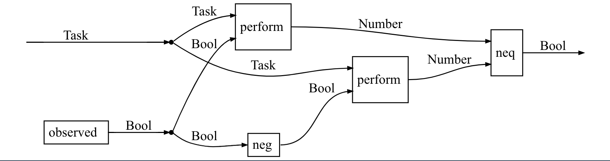
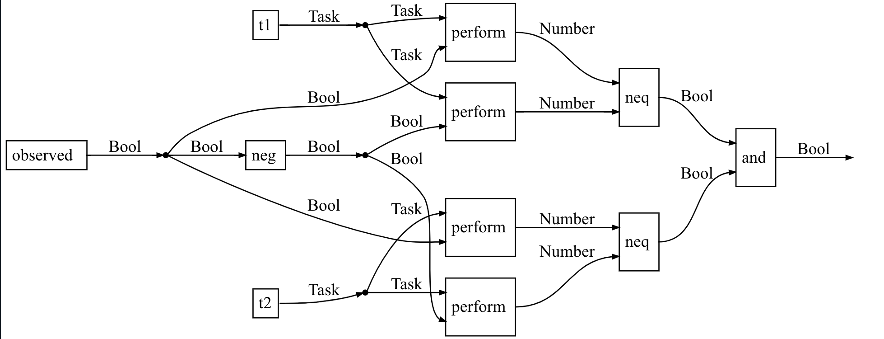
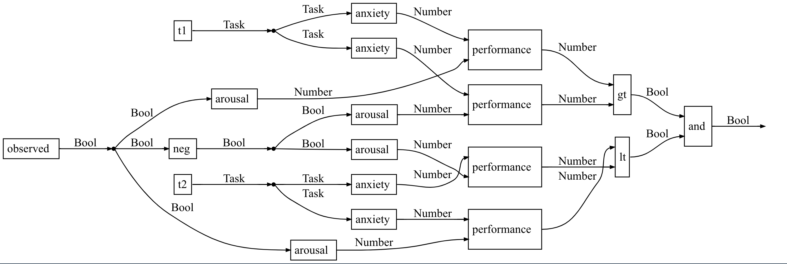
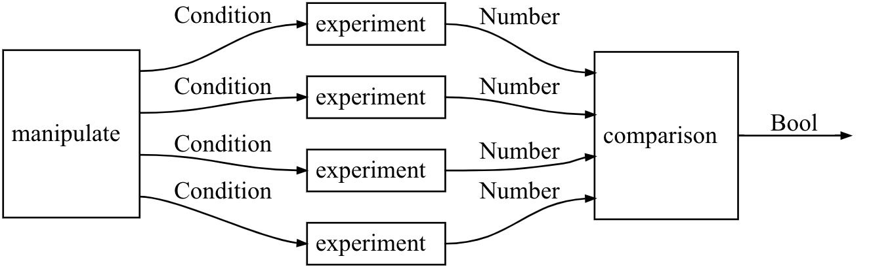
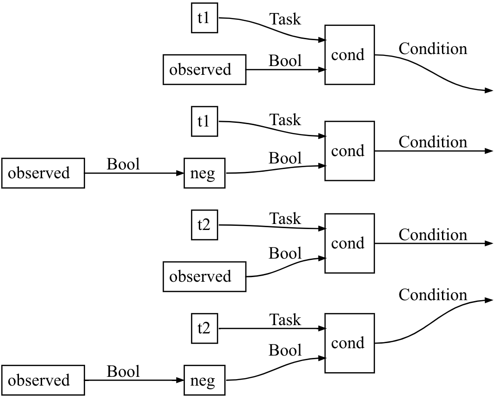
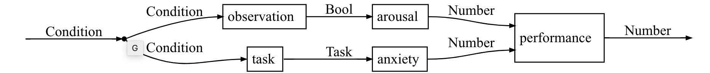
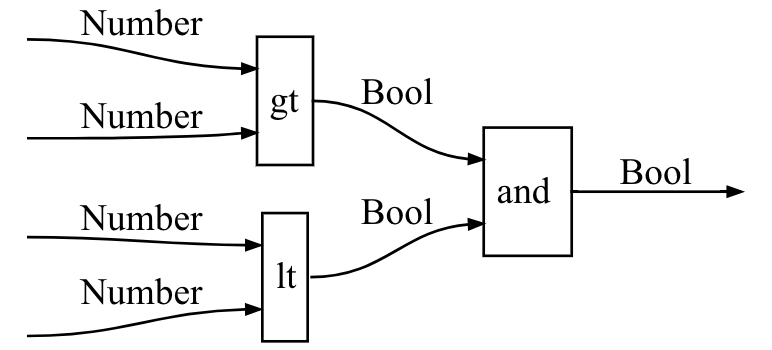
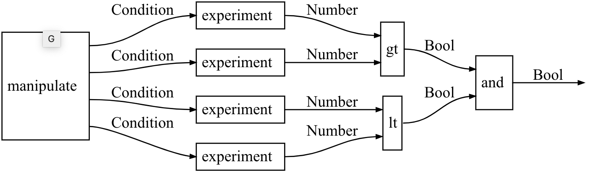
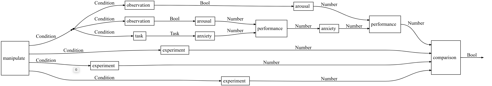
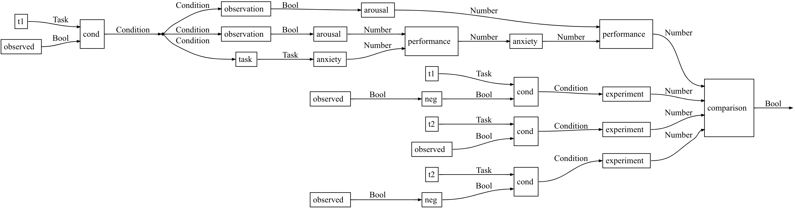

# SocialTheories.jl

Social Theories provides data structures and algorithms for explicitly representing the kinds of theories that social scientists use to explain phenomena. They are built out of a Catlab `Presentations` of Cartesian Categories. By explicitly representing the theories, you can build software that applies formal methods techniques from programming language theory to the analysis and verification of social scientific experiments and hypotheses. This analysis should enable faster development of social scientific research through automation of modeling and statistical tasks

## Concepts

1. Theory: A social theory is a presentation `P` of a `CartesianCategory`. The objects are the types of the variables in the theory for example `Number`, `Bool`, `Count`, etc. The processes (morphisms) are causal processes that relate causes to effects. The morphism `f: A→B` asserts the existence of a causal process by which `A` causes `B`.

2. Phenomenon: we represent a social phenomenon as a causal process `f: A→B`, the domain `A` is the variable you can manipulate and the codomain `B` is the variable you can measure.

3. Hypothesis: a hypothesis is just a phenomena that has true or false outcomes. Formally, `h: A→Bool` if and only if `h` is a hypothesis. This captures the idea that a hypothesis is a predicate, it can be true or false.

4. Model: a model of a social theory is a probabilistic interpretation of that theory. We model these by functors into `Stoch` the category of stochastic processes as Markov kernels.

5. Theory Homomorphisms: two theories `C,D` can be related by a homomorphism `ϕ: C\to D` if you can map every variable `A ∈ Ob(C)` to a variable `ϕ(A) ∈ D` and every causal process of `f ∈ Hom(C)` to a causal process `ϕ(f) ∈ Hom(D)` properties of these homomorphisms characterize intuitive relationships between theories.

## Examples

See the `doc/src/SocialFacilitation.jl` for a complete version of this example.


### SocialFacilitation: our first psychological theory

We include:

    1. types for numbers and booleans,
    2. arithmetic and logical operators,
    3. constant values like true, false, easy, hard, and observed,
    4. a causal mechanism perform(audience::Bool, task::Bool)::Number

Our social facilitation hypothesis can be expressed in this theory.

```julia
@present SocialFacilitation(FreeCartesianCategory) begin
    Number::Ob
    Bool::Ob
    Task::Ob

    plus::Hom(Number⊗Number, Number)
    diff::Hom(Number⊗Number, Number)
    times::Hom(Number⊗Number, Number)
    div::Hom(Number⊗Number, Number)

    and::Hom(Bool⊗Bool, Bool)
    neg::Hom(Bool, Bool)
    eq::Hom(Number⊗Number, Bool)
    neq::Hom(Number⊗Number, Bool)

    ⊤::Hom(munit(), Bool)
    ⊥::Hom(munit(), Bool)

    t1::Hom(munit(), Task)
    t2::Hom(munit(), Task)

    observed::Hom(munit(), Bool)

    perform::Hom(Task⊗Bool, Number)
end
```

Our first hypothesis says that for any given task, a participant
will perform better when observed, than when not observed.

```julia
sfmodel = @program SocialFacilitation (task::Task) begin
    a = observed()
    t = task
    s₁ = perform(t, a)
    s₂ = perform(t, neg(a))
    return neq(s₁, s₂)
end

viz(sfmodel)
```



Our second hypothesis says that the effect of social facilitation
depends on the difficulty of the task. For easy tasks observers increase performance
but for not easy tasks they decrease performance.

```julia
ttmodel = @program SocialFacilitation () begin
    a = observed()
    ua = neg(a)
    t = t1()
    s₁ = perform(t, a)
    s₂ = perform(t, ua)
    b₁ = neq(s₁, s₂)

    t = t2()
    s₁ = perform(t, a)
    s₂ = perform(t, ua)
    b₂ = neq(s₁, s₂)
    return and(b₁, b₂)
end

viz(ttmodel)
```



We can refine the SocialFacilitation theory into the ArousalAnxietyFacilitation theory by adding some new causal processes. This refinement is given by the functor `ArousalAnxietyFacilitation => SocialFacilitation`

1. `(arousal⊗anxiety)⋅performance ↦ perform`,
1. `< ↦ !=`
1. `> ↦ !=`
1. identity everywhere else

Because this functor is *surjective*, any model of SocialFacilitation is a model of ArousalAnxietyFacilitation. The functor can be implemented using an imperative julia interface:

```julia
ArousalAnxietyFacilitation = deepcopy(SocialFacilitation)
b, num = generators(SocialFacilitation, [:Bool, :Number])
gens = [
    Hom(:arousal, num, num),
    Hom(:anxiety, num, num),
    Hom(:performance, num⊗num, num),
    Hom(:gt, num⊗num, b),
    Hom(:lt, num⊗num, b)
]
map(g->add_generator!(ArousalAnxietyFacilitation, g), gens)

arousal, anxiety, performance = gens
rhs = (arousal⊗anxiety)⋅performance
perform = generator(SocialFacilitation, :perform)
add_equation!(ArousalAnxietyFacilitation, perform, rhs)
```

The result of applying this refinement is a new theory equivalent to:

```julia
@present ArousalAnxietyFacilitation(FreeCartesianCategory) begin
    Number::Ob
    Bool::Ob
    Task::Ob

    plus::Hom(Number⊗Number, Number)
    diff::Hom(Number⊗Number, Number)
    times::Hom(Number⊗Number, Number)
    div::Hom(Number⊗Number, Number)

    and::Hom(Bool⊗Bool, Bool)
    neg::Hom(Bool, Bool)
    eq::Hom(Number⊗Number, Bool)
    neq::Hom(Number⊗Number, Bool)
    gt::Hom(Number⊗Number, Bool)
    lt::Hom(Number⊗Number, Bool)

    ⊤::Hom(munit(), Bool)
    ⊥::Hom(munit(), Bool)

    t1::Hom(munit(), Task)
    t2::Hom(munit(), Task)

    observed::Hom(munit(), Bool)

    arousal::Hom(Bool, Number)
    anxiety::Hom(Task, Number)
    performance::Hom(Number⊗Number, Number)
end
```

Our new refined hypothesis says that the effect of social facilitation
depends on the difficulty of the task. For easy tasks observers increase performance but for not easy tasks they decrease performance. This was not expressible in the original SocialFacilitation theory but is expressible in the ArousalAnxietyFacilitation theory because we now have operators for greater than (`gt`) and (`lt`).

```julia
aamodel = @program ArousalAnxietyFacilitation () begin
    a = observed()
    ua = neg(a)
    t = t1()
    s₁ = performance(anxiety(t), arousal(a))
    s₂ = performance(anxiety(t), arousal(ua))
    b₁ = gt(s₁, s₂)

    t = t2()
    s₁ = performance(anxiety(t), arousal(a))
    s₂ = performance(anxiety(t), arousal(ua))
    b₂ = lt(s₁, s₂)
    return and(b₁, b₂)
end

viz(aamodel)
```




# The structure of an experiment

```julia
@present HighLevel(FreeCartesianCategory) begin
    Number::Ob
    Bool::Ob
    Task::Ob
    Condition::Ob

    plus::Hom(Number⊗Number, Number)
    diff::Hom(Number⊗Number, Number)
    times::Hom(Number⊗Number, Number)
    div::Hom(Number⊗Number, Number)

    and::Hom(Bool⊗Bool, Bool)
    neg::Hom(Bool, Bool)
    eq::Hom(Number⊗Number, Bool)
    neq::Hom(Number⊗Number, Bool)
    gt::Hom(Number⊗Number, Bool)
    lt::Hom(Number⊗Number, Bool)

    ⊤::Hom(munit(), Bool)
    ⊥::Hom(munit(), Bool)

    t1::Hom(munit(), Task)
    t2::Hom(munit(), Task)

    observed::Hom(munit(), Bool)

    arousal::Hom(Bool, Number)
    anxiety::Hom(Task, Number)
    performance::Hom(Number⊗Number, Number)

    manipulate::Hom(munit(), Condition⊗Condition⊗Condition⊗Condition)
    experiment::Hom(Condition, Number)
    comparison::Hom(Number⊗Number⊗Number⊗Number, Bool)

    task::Hom(Condition, Task)
    observation::Hom(Condition, Bool)
    cond::Hom(Task⊗Bool, Condition)
end

    # experiment::Hom(s::Task, t::Task, obs::Bool, nobs::Bool)

hlmodel = @program HighLevel () begin
    conditions = manipulate()
    data = [experiment(c) for c in conditions]
    result = comparison(data...) # := comparison(data[1], data[2], data[3], data[4])
    return result
end

viz(hlmodel)
```



Given that structure of the high level experiment, we can plug in sub experiments
for each high level abstract box.

```julia
exp = @program HighLevel (c::Condition) begin
    t, o = task(c), observation(c)
    return performance(arousal(o), anxiety(t))
end

manip = @program HighLevel () begin
    c11 = cond(t1(), observed())
    c21 = cond(t2(), observed())
    c12 = cond(t1(), neg(observed()))
    c22 = cond(t2(), neg(observed()))
    return c11, c12, c21, c22
end

viz(manip)

cmp = @program HighLevel (a::Number, b::Number, c::Number, d::Number) begin
    return and(gt(a,b), lt(c,d))
end
```

We specify the manipulations we want to do, by listing out four conditions.



Then we describe the experiment we will do.



And the comparison operation we will compute.



```julia
d0 = substitute(hlmodel, 8, cmp)
d1 = substitute(d0, 4, exp)
d2 = substitute(d1, 3, manip)

```

We substitute from right to left, because it makes the numbering eaiser.

Adding in the comparison:


Describing the experiment:


Specifying the manipulations:

